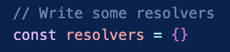

# Graphql Server with GitHub fetched schema

A Graphql Server that updates it's schema from a github repository. This project allows the user to import a specific schema already definied and ready to be loaded into a server, that is stored in any github repository.

## Prerequisites

- Node.js installed (version v16.17.0 and upper)
- A valid Git account

## How to install and Run the project

- First you will have to clone the project from this github repository

```bash
git clone https://github.com/syordanov94/node_server_graph.git
```

- Once cloned you will have to set up the enviroment variables you require. This means that you should create a *.env* file and include it in the project. This file will have the following content:

```
PERSONAL_ACCESS_TOKEN = "WRITE YOUR PERSONAL GIT ACCESS TOKEN HERE"
```

*for more information on how to generate a personal access token, check this [link](https://docs.github.com/en/enterprise-server@3.3/authentication/keeping-your-account-and-data-secure/creating-a-personal-access-token)*

- Import all the node modules you require to run the project

```bash
npm install
```

- Finally, run the server with the following command:

```bash
node server.js *GIT_USER_WHOSE_SCHEMA_YOU_WANT_TO_CLONE* *GITHUB_SCHEMA_PROJECT_NAME* *GITHUB_SCHEMA_PROJECT_BRANCH*
```

*NOTE: As I mentioned before, the schema needs to be correctly defined and not have any errors in order for the server to correctly process it*

## How to test the project

Once you run the server you can see if the schema is correctly loaded accesing the following url that appeares in the console output:


This will display a Playground enviroment where you can see the API schema definition.

Now you can start writing some resolvers for your schema and adding the functionality. This can be done by updating the *server.js* file where the resolvers are defined:



And voilà, you now have a Graphql API template that loads it's schema from github.